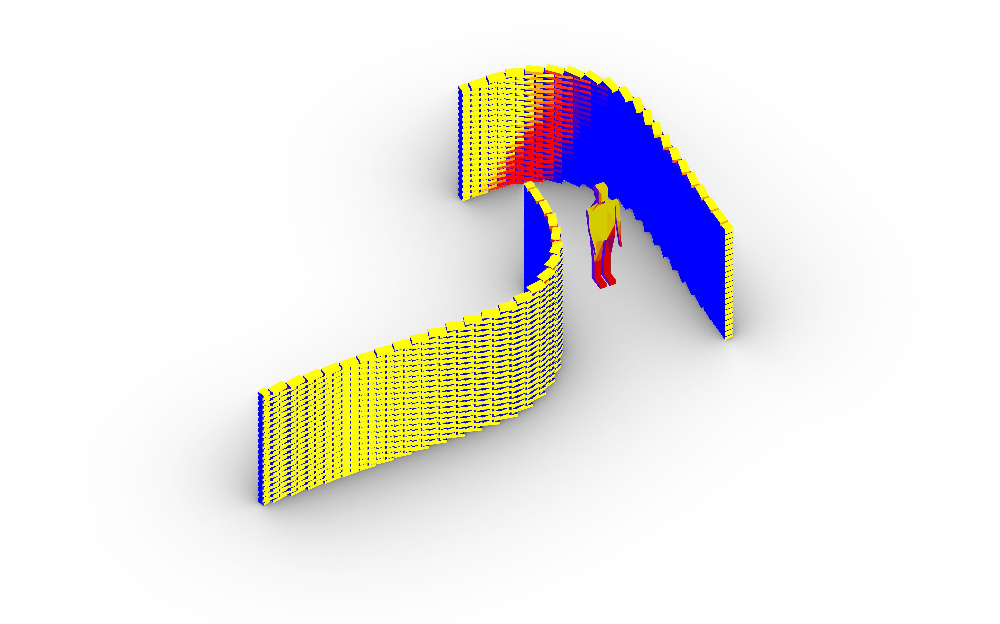

# Climate Active Bricks

This project examines the microclimate effects of differentiated robotically fabricated brick facades. Through this course we will explore environmental modeling tools to quantify local impacts of brick walls. We will use computational simulations to provide optimized alternatives for robotically manufacturing of brick elements. These tools will support us in the process of design and decision making to understand the microclimatic impacts on human scale.

## Requirements

* Operating System: **Windows 10 Pro**
* [Rhinoceros 3D 6.0](https://www.rhino3d.com/)
* [Anaconda Python Distribution](https://www.anaconda.com/download/): 3.x
* Git: [official command-line client](https://git-scm.com/) and visual GUI (e.g. [Github Desktop](https://desktop.github.com/))
* [VS Code](https://code.visualstudio.com/) with the following `Extensions`:
  * `Python` (official extension)

## Getting started

### Compas Installation 
(via your Anaconda Terminal)
    
    (base)  conda config --add channels conda-forge
    (base)  conda create -n your_env_name python=3.7 compas=0.15.6 --yes
    (base)  conda activate your_env_name
    (your_env_name) python -m compas_rhino.install -v 6.0 -p compas compas_ghpython compas_rhino
    
### Verify Installation

    (your_env_name) python
    >>> import compas_fab
    >>> compas_fab.__version__
    '0.15.6'
    >>> exit()

## Installation and Dependencies - Geometry and Fabrication

### Installation climate_active_bricks:

* Clone the [climate_active_bricks](https://github.com/augmentedfabricationlab/climate_active_bricks) repository into your project workspace.

### Installation assembly_information_model:

* Clone the [assembly_information_model](https://github.com/augmentedfabricationlab/assembly_information_model) repository into your project workspace.

* Change to the directory of the repository and use pip install to copy the repository to your Anaconda environment site packages: 

`(your_env_name) pip install your_filepath_to_assembly_information_model`    

* And make the projects accessible from Rhino 

`(your_env_name) invoke add-to-rhino`

### Installation ur_online_control:

* Install Ironpython 2.7.9. via following this [link](https://github.com/IronLanguages/ironpython2/releases/tag/ipy-2.7.9)
* Clone the current version of the [ur_online_control repository](https://github.com/augmentedfabricationlab/ur_online_control) 
into your project workspace.
* Make the project accessible from Rhino by adding the following two directories to the Rhino Pyhon path (via >> EditPythonScript >> Tools >> Options >> Add to search path):
    1. Ironpython Path, e.g., C:\Program Files\IronPython 2.7\Lib
    2. Parent folder of ur_online_control repository, e.g., C:\Users\yourname\workspace\projects

### Other Dependecies:

* shapely: `(your_env_name) conda install shapely`

## Installation and Dependencies - Environmental Analysis and Optimization

### Ladybug Tools for Environmental Analysis

* Install Ladybug Tool via https://www.ladybug.tools/ladybug.html

### Discover for Optimization

* Install Discover via https://colidescope.github.io/discover/

## Example files

You find various example files in the `rhino` folder.

Credits
-------------

[@augmentedfabricationlab](https://github.com/augmentedfabricationlab)
